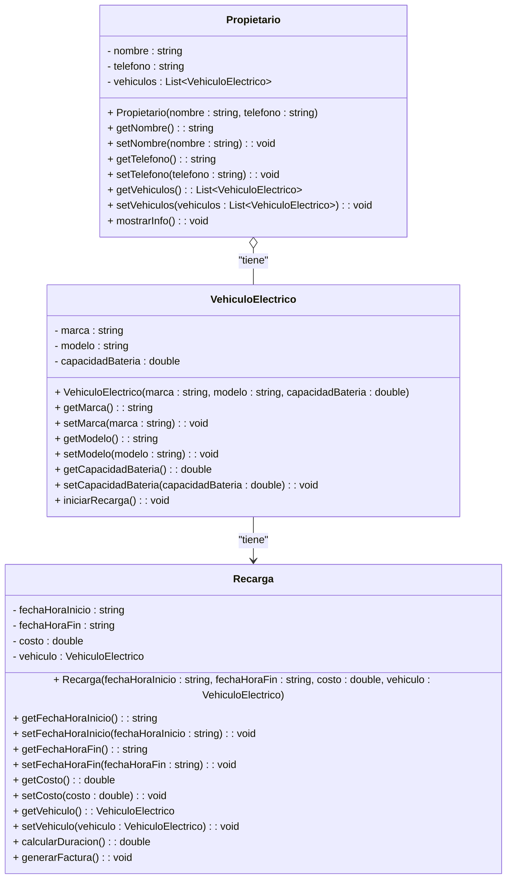
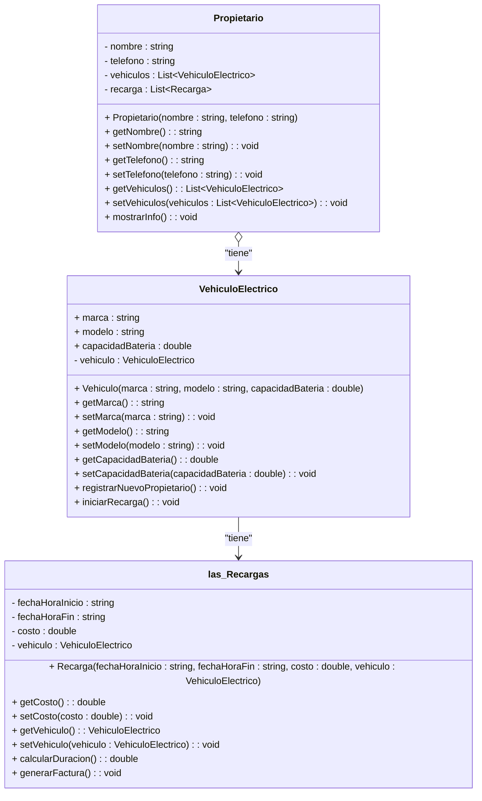

##Solución correcta inicial

# Solución con fallos.
1. los atributos de vehiculo electrico deberían ser privados
2. La flecha de propietario es de agregación y no necesita la de asociación
3. El método + registrarNuevoPropietario (): void en vehículo electrico no tiene funcionalidad por principio de responsabilidad y por las relaciones
4. la clase las_Recargas debería ser un nombre en singular y con mayúscula incial
5. En la clase Recarga deberían estar los get, y los set para los atributos de fecha
6. La clase VehiculoElectrico tiene un atributo de la misma clase y ello no tiene utilidad
7. El propietario tiene un atributo - recarga : List~Recarga~ pero realmente no hay una relación directa de agregación entre Propietario y Recarga
8. El constructor de VehiculoElectrico no se llama igual que la clase

